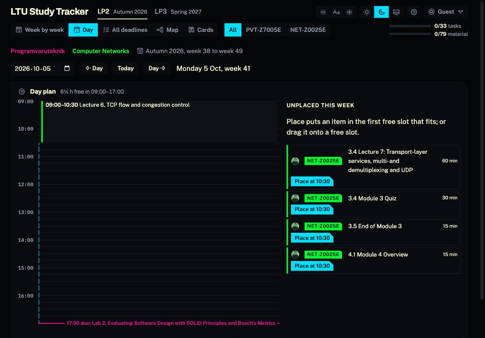

# LTU Study Tracker

A study planner for students of LTU courses: what is on today, what is due, what to study before
it, and what has been done. Built for the classmates of Z7005E Programvaruteknik and Z0025E
Computer Networks, autumn 2026; courses are data, so more can be added.



- **The web app:** https://ltu-studytracker.dentaku.se
- **The original claude.ai page** (still served, points to the app): https://claude.ai/artifact/Tkm4xHdppNkcTGJ3xsrgoU

Unofficial, made by a student. Not an LTU service; Canvas is always right when the two disagree.

## What it does

- **Week by week, Day, All deadlines, Map**: every session, deadline and piece of Canvas material
  of both courses, with links; Day is a day plan in 15-minute slots with free time to place work.
- **Ticks that follow you**: sign in with Google, or stay a guest and keep them in the browser.
- **Your own Canvas status** beside each tick, read with your own Canvas token (never stored).
- **Lab bookings** from the signup sheet, with a warning that grows as the session comes closer.
- **Your calendars**: a group calendar's events among the sessions, as busy time.
- **Study cards** with spaced repetition aimed at each lab and exam, checked by classmates.
- **Prep chains**: each lab, workshop and exam with everything that leads to it.
- **Updates itself every hour** from Canvas.

More: [docs/hosted-app.md](docs/hosted-app.md) (features, privacy and security) and
[docs/page-guide.md](docs/page-guide.md) (every view and control).

## How it is put together

```
data/plan.mjs          the hand-written Course Plan: sessions, tasks, needs, bookings, disagreements
data/canvas-inventory.json  modules, items and deadlines read from Canvas (npm run update)
data/cards/            drafted study cards, uploaded with tools/cards/upload.mjs
src/template.html      the page: one file, plain JavaScript, no framework
tools/                 the page build, the Canvas client and sync, scans, card upload, favicon
app/                   the web app: Next.js, serves the page and the API routes
app/public/bridge.js   gives the page its storage and account calls on top of Supabase
app/supabase/          database migrations and the privacy tests
docs/                  plans, decisions, guides, scans, reports
```

- **One page, two homes.** `src/template.html` is built by `tools/build.mjs` into one HTML file. The
  claude.ai artifact publishes it as is. The app serves the same file and adds `bridge.js`, which
  answers the page's `window.claude.use("db" | "user")` calls with Supabase, so the page itself
  needs no change to run in both places.
- **Three layers of data** ([CONTEXT.md](CONTEXT.md)): the Course Plan (the same for everyone),
  a Group's shared data, and each Student's own. Who may read what is decided by row-level
  security in the database ([ADR 0003](docs/adr/0003-privacy-is-enforced-by-the-database.md)).
- **Tokens.** A Student's Canvas token stays in their browser and only passes through the server
  ([ADR 0001](docs/adr/0001-only-the-sync-token-is-stored.md)). The one stored token is the
  Maintainer's Sync Token, encrypted in Vault, used hourly by a role that can only read it and
  replace the Course Plan.

## Working on it

Requirements: Node 22, and for Canvas a token in `.env` (`CANVAS_TOKEN=...`) or the Keychain item
`ltu-canvas-token`.

```sh
npm run check              # compare the committed inventory with Canvas, list new announcements and calendar events
npm run update             # read Canvas again and rebuild the page
npm run build              # build ltu-study-tracker.html from the template and the plan
npm test                   # the tick merge rule, run against the template's own code

cd app && npm install
cp .env.example .env.local # the Supabase address and its public anon key
npm run dev                # http://localhost:3000, builds the page first
npm test                   # signup sheet and iCal parsers
node scripts/sync.mjs --dry-run   # the hourly sync, against Canvas, storing nothing
```

The page and the plan in detail: [docs/maintaining.md](docs/maintaining.md).

## Deploying

A push to `main` that touches `app/`, `src/`, `data/` or `tools/` runs
[.github/workflows/app.yml](.github/workflows/app.yml): the tests, a type check, the build, an image
pushed to `ghcr.io/laszloprekop/ltu-study-tracker`, and a Coolify webhook that deploys it. The
claude.ai page is republished by hand. Setting it all up the first time:
[docs/plan/go-live.md](docs/plan/go-live.md).

Database changes are SQL files in `app/supabase/migrations/`, applied in order over SSH, then
checked with `app/supabase/tests/rls.sql` ([app/supabase/README.md](app/supabase/README.md)).

## Documentation

| | |
|---|---|
| [CONTEXT.md](CONTEXT.md) | the glossary: Course Plan, Key Event, Prep, Booking, Card, Tick, Status |
| [docs/hosted-app.md](docs/hosted-app.md) | what the app does, privacy and security |
| [docs/page-guide.md](docs/page-guide.md) | the page's views and controls in detail |
| [docs/maintaining.md](docs/maintaining.md) | building the page, editing the Course Plan, commands |
| [docs/plan/](docs/plan/) | the releases: [1](docs/plan/release-1.md), [2](docs/plan/release-2.md), [3](docs/plan/release-3.md), [4](docs/plan/release-4.md), [5](docs/plan/release-5.md), and [going live](docs/plan/go-live.md) |
| [docs/adr/](docs/adr/) | decisions: the Sync Token, graded answers, privacy in the database |
| [docs/canvas-data-map.md](docs/canvas-data-map.md), [docs/scan/](docs/scan/) | where each kind of data lives in Canvas |
| [docs/reports/](docs/reports/) | places where the course material disagrees, for the teachers |

## Licence and credits

Icons: [Phosphor](https://phosphoricons.com) (MIT, `assets/icons/LICENSE`). FSRS scheduling:
[ts-fsrs](https://github.com/open-spaced-repetition/ts-fsrs) (MIT).
